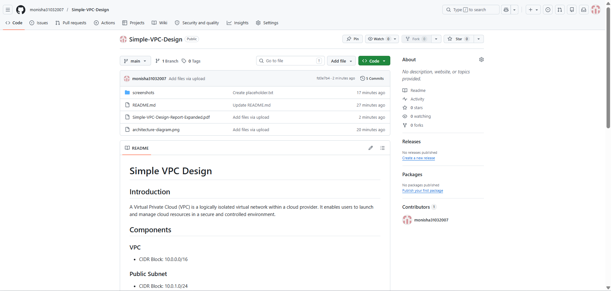
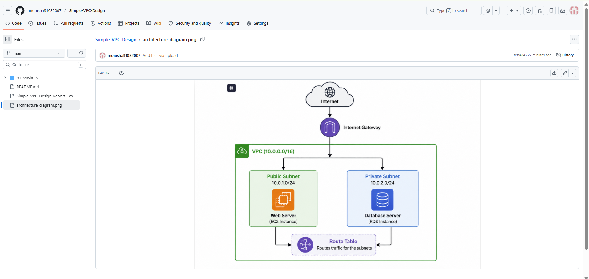

# Simple VPC Design

## Intern Information

**Name:** Monisha S  
**Intern ID:** CITS2080  
**Domain:** Cloud Computing  

## Overview

Simple VPC Design demonstrates the design and implementation of a Virtual Private Cloud (VPC). The project focuses on creating secure network environments, configuring subnets, routing traffic, and understanding cloud networking concepts.

## Introduction

A Virtual Private Cloud (VPC) is a logically isolated virtual network within a cloud provider. It enables users to launch and manage cloud resources in a secure and controlled environment.

## Components

### VPC
- CIDR Block: 10.0.0.0/16

### Public Subnet
- CIDR Block: 10.0.1.0/24
- Hosts web servers.

### Private Subnet
- CIDR Block: 10.0.2.0/24
- Hosts database servers.

### Internet Gateway
- Provides internet access to the public subnet.

### Route Table
- Controls network traffic routing.

## Architecture Design

```text
                Internet
                    │
                    ▼
          Internet Gateway
                    │
                    ▼
          ──────────────────
           VPC 10.0.0.0/16
          ──────────────────
                    │
              ┌─────┴─────┐
              │           │
              ▼           ▼
        Public Subnet  Private Subnet
              │           │
              ▼           ▼
         Web Server   Database Server
```

## Advantages

- Security
- Isolation
- Scalability

## Conclusion

A VPC provides a secure and scalable networking environment for cloud resources.


## Screenshots

### Repository Overview



### Architecture Diagram


